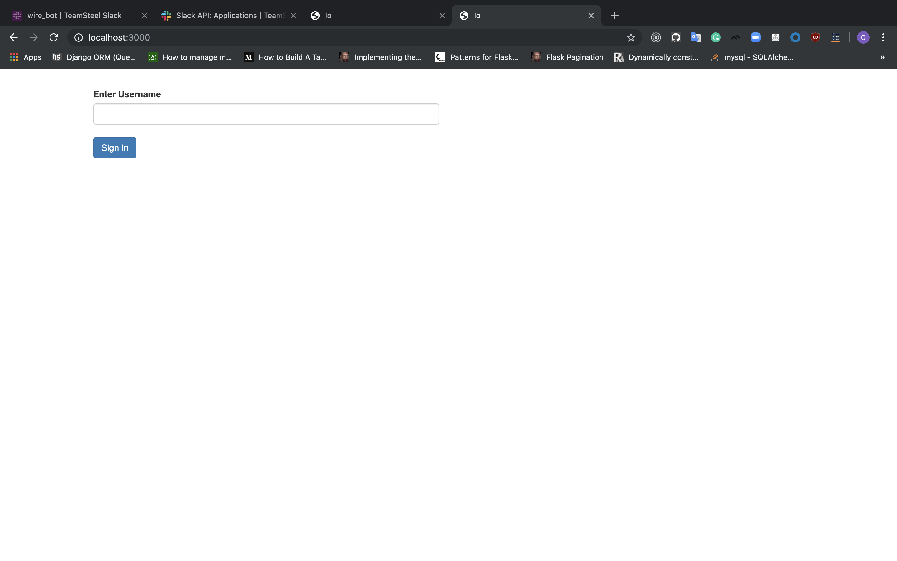
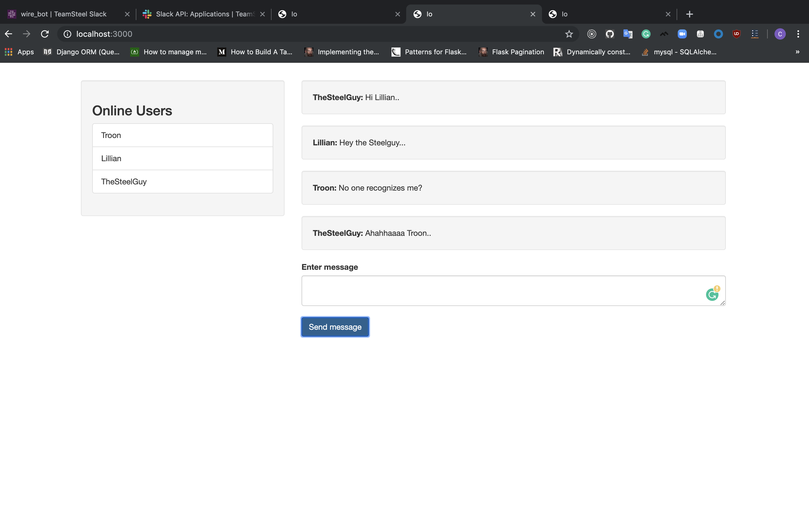

### Quick Set-up
***This a simple node js application which implient a basic chat server***

###Technologies used:
***node**
***Jquey***
***Socket.io***
***Bootstrap***


Ensure you have the following installed locally:

- [Node](https://nodejs.org/en/)

Clone repo:

```
git clone https://github.com/TheSteelGuy/noderealtimeChatServer.git
```

Navigate to repo:

```
cd iochat
```

Install all dependencies:

```
npm install
```

##Run the sever
```npm start
```
###Go to the broswer open type
```
localhost:3000
```
## screen shots




